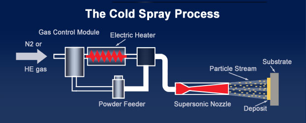
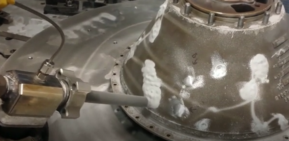

# Cleaning-Log-Data-using-R

Cold spray is a coating deposition process in which powdered material is accelerated to supersonic speeds, as high as Mach 3. The accelerated powder is deposited onto a similar or dissimilar material surface. The powders reach high velocity using a high-pressure, electrically heated carrier gas, like nitrogen or helium.

Every time a spray is done, machine generates a log. In the event, where the coating quality is not good the logs are inspected to see what caused the problem. However, the log generated by the machine is extremely messy and requires lot of cleaning before any interpretation can be made from it. In this notebook, I cleaned the log and plotted it against time to compare the actual values with the set point values.

